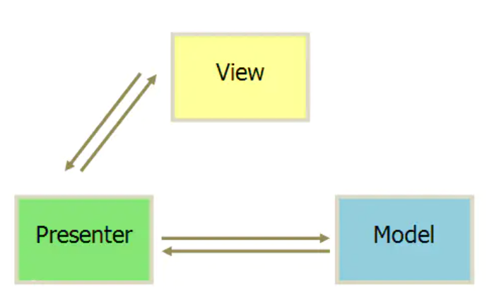

# 1. MVC框架

MVC全名是Model View Controller，是模型(model)－视图(view)－控制器(controller)的缩写，一种软件设计典范，用一种业务逻辑、数据、界面显示分离的方法组织代码，将业务逻辑聚集到一个部件里面，在改进和个性化定制界面及用户交互（view controller）的同时，不需要重新编写业务逻辑(Model)。MVC被独特的发展起来用于映射传统的输入、处理和输出功能在一个逻辑的图形化用户界面的结构中。

### MVC 编程模式

- Model（模型）表示应用程序核心（如数据库）
  - 应用程序中用于处理应用程序数据逻辑的部分,通常模型对象负责在数据库中存取数据。
- View（视图）显示效果（HTML或xaml页面）
  - 应用程序中处理数据显示的部分，通常视图是依据模型数据创建的。
- Controller（控制器）处理输入（业务逻辑）
  - 应用程序中处理用户交互的部分，通常控制器负责从视图读取数据，控制用户输入，并向模型发送数据

### 优点

**耦合性低**

- 视图层和业务层分离，这样就允许更改视图层代码而不用重新编译模型和控制器代码，同样，一个应用的业务流程或者业务规则的改变只需要改动MVC的模型层即可。因为模型与控制器和视图相分离，所以很容易改变应用程序的数据层和业务规则。

**重用性高**

- 多个视图能共享一个模型，

### 缺点

**视图与控制器间的过于紧密的连接**

- 视图与控制器是相互分离，但却是联系紧密的部件，==视图没有控制器的存在，其应用是很有限的==，反之亦然，这样就妨碍了他们的独立重用。

**视图对模型数据的低效率访问**

- 依据模型操作接口的不同，视图可能需要多次调用才能获得足够的显示数据。对未变化数据的不必要的频繁访问，也将损害操作性能。

# 2. MVP模式

全称：Model-View-Presenter ；MVP 是从经典的模式MVC演变而来，它们的基本思想有相通的地方Controller/Presenter负责逻辑的处理，Model提供数据，View负责显示。

## 优点

1、模型与视图完全分离，我们可以修改视图而不影响模型

2、可以更高效地使用模型，因为所有的交互都发生在一个地方——Presenter内部

3、我们可以将一个Presenter用于多个视图，而不需要改变Presenter的逻辑。这个特性非常的有用，因为视图的变化总是比模型的变化频繁。

4、如果我们把逻辑放在Presenter中，那么我们就可以脱离用户接口来测试这些逻辑（单元测试）

## 缺点

由于对视图的渲染放在了Presenter中，所以视图和Presenter的交互会过于频繁。还有一点需要明白，如果Presenter过多地渲染了视图，往往会使得它与特定的视图的联系过于紧密。一旦视图需要变更，那么Presenter也需要变更了。比如说，原本用来呈现Html的Presenter现在也需要用于呈现Pdf了，那么视图很有可能也需要变更。

## MVP与MVC区别：

作为一种新的模式，MVP与MVC有着一个重大的区别：在MVP中View并不直接使用Model，它们之间的通信是通过==Presenter (MVC中的Controller)==来进行的，所有的交互都发生在Presenter内部，==而在MVC中View会直接从Model中读取数据而不是通过 Controller==。
 在MVC里，View是可以直接访问Model的！从而，View里会包含Model信息，不可避免的还要包括一些业务逻辑。 在MVC模型里，更关注的Model的改变，而同时有多个对Model的不同显示，即View。所以，==在MVC模型里，Model不依赖于View，但是View是依赖于Model的==。不仅如此，因为==有一些业务逻辑在View(xaml对应cs文件)里实现了，导致要更改View也是比较困难的，至少那些业务逻辑是无法重用的==。
 虽然 MVC 中的 View 的确“可以”访问 Model，但是我们不建议在 View 中依赖 Model，而是要求尽可能把所有业务逻辑都放在 Controller 中处理，而 View 只和 Controller 交互。

# 3.MVVM框架

MVVM是Model-View-ViewModel的简写。它本质上就是MVP 的改进版。MVVM 就是将其中的View 的状态和行为抽象化，让我们将视图 UI 和业务逻辑分开。当然这些事 ViewModel 已经帮我们做了，它可以取出 Model 的数据同时帮忙处理 View 中由于需要展示内容而涉及的业务逻辑。

### MVVM模式的组成部分

- Model 模型
  - 指代表真实状态内容的领域模型（面向对象），或指代表内容的数据访问层（以数据为中心）。
- View 视图
  - MVC和MVP模式中一样，视图是用户在屏幕上看到的结构、布局和外观（UI）。
- ViewModel 视图模型
  - 暴露公共属性和命令的视图的抽象。
  - MVVM没有MVC模式的控制器，也没有MVP模式的presenter，有的是一个*绑定器*。在viewmodel中，绑定器负责视图view和数据model之间进行通信。
- 绑定器
  - 声明性数据和命令绑定隐含在MVVM模式中。
  - 在Microsoft解决方案堆中，绑定器是一种名为XAML的标记语言。
  - 绑定器使开发人员免于被迫编写样板式逻辑来同步视图模型和视图。

### MVVM优点

MVVM模式和MVP模式一样，主要目的是分离视图（View）和模型（Model），有几大优点

**1. 低耦合**。视图（View）可以独立于Model变化和修改，一个ViewModel可以绑定到不同的"View"上，当View变化的时候Model可以不变，当Model变化的时候View也可以不变。

**2. 可重用性**。你可以把一些视图逻辑放在一个ViewModel里面，让很多view重用这段视图逻辑。

**3. 独立开发**。开发人员可以专注于业务逻辑和数据的开发（ViewModel），设计人员可以专注于页面设计，使用Expression Blend可以很容易设计界面并生成xaml代码。

**4. 可测试**。界面素来是比较难于测试的，而现在测试可以针对ViewModel来写。

###  MVVM与MVP区别：

mvvm模式将Presener改名为View Model，基本上与MVP模式完全一致，唯一的区别是，它采用双向绑定(data-binding):   View的 变动，自动反映在View Model。这样开发者就不用处理接收事件和View更新的工作

---

# 4. example

- [HongmingKuang/mvc-mvp-mvvm-gameExample (github.com)](https://github.com/HongmingKuang/mvc-mvp-mvvm-gameExample)

