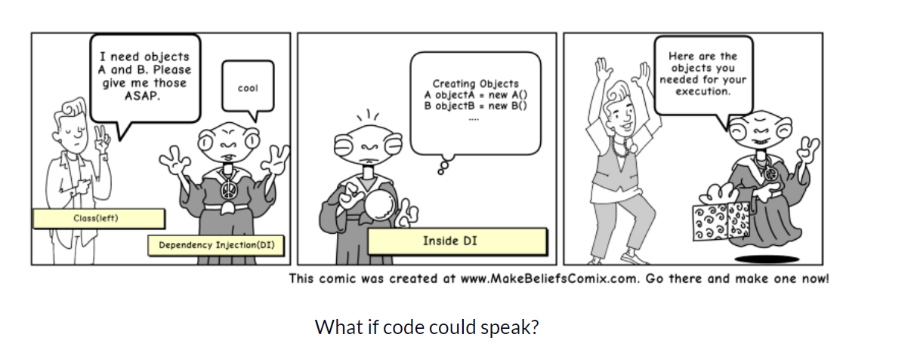

# DI(Dependency Injection)

## Introduction

- 当Class A 使用Class B的功能函数时，我们就称A依赖B

  - 我们需要先建立Class B的实例 然后才能使用B的方法

- 把创建对象（B）的任务交给其他人，然后使用这个依赖对象，就称为依赖注入

  

## Why should I use dependency injection?

- Example

  - 一个车用的MRF车轮（车依赖MRF车轮）

    - ```c#
      private class Car
      {
         MRFWheel mw = new MRFWheel();
         void init()
         {
             //use mw
         }
          void assemble()
          {
              //use mw
          }
          public Car(){}
      }
      private class Factory()
      {
          Car car = new Car();
      }
      ```

  - 如果这个车要换成Yokohama车轮，那么以上那个类要修改所有使用MRF车轮的代码

  - 当我们使用DI时，可以在运行时更改轮子类型（因为依赖可以在运行时注入而不是编译时注入）

## Three Types of DI

- 构造函数注入

  - 依赖通过类构造函数注入

    - ```c# 
      public Car(MRFWheel mw){}
      ```

- Setter方法注入

  - 通过类的Set方法，运行时设置依赖对象

    - ```c#
      private class Car
      {
         IWheel _wheel;
         void init()
         {
             //use mw
         }
          public void Set(IWheel wheel)
          {
              _wheel = wheel;
          }
          void assemble()
          {
              //use mw
          }
          publicc Car(){}
      }
      ```

    - Factory调用车时只要要`car.Set(' ')` 参数传入你需要组装的车轮

- 接口注入

  - 被依赖对象（Wheel）提供一个注入方法，将注入到所有用到它的类中

## DI Responsibility

1. 创建对象

2. 知道那些类需要对象

3. 提供这些类对象

## Inversion of control (控制反转)

- 表示一个类不需要静态的配置它的依赖项 而是应该被其他外部类配置
- 一个类应该关注实现使用这些对象而不是创建这些对象

## DI Benefits

- 有利于集成测试
- 样板代码减少，因为初始化依赖由注入组件完成
- 容易扩展
- 低耦合

## DI Disadvantages

- 编译没问题但运行可能会出错

---

## DI Example

### Don't use DI

- EmailService类来实现发送邮件 -->Helper 功能帮助层

  ```c#
  public class EmailService {
  
  	public void sendEmail(String message, String receiver){
  		//logic to send email
  		System.out.println("Email sent to "+receiver+ " with Message="+message);
  	}
  }
  ```

- MyApplication类(客户端(A/Car)代码)来实现发送邮件 --> Service 管理类

  ```c#
  public class MyApplication {
  
  	private EmailService email = new EmailService();
  	
  	public void processMessages(String msg, String rec){
  		//do some msg validation, manipulation logic etc
  		this.email.sendEmail(msg, rec);
  	}
  }
  ```

- Test类  --Controller 逻辑控制类

  ```c#
  public class MyLegacyTest {
  
  	public static void main(String[] args) {
  		MyApplication app = new MyApplication();
  		app.processMessages("Hi Pankaj", "pankaj@abc.com");
  	}
  
  }
  ```

- MyApplication对EmailService有hard-coded dependency 如果我们后面通过其他方式发送邮件的话就要在MyApplication改动代码，如果EmailService被多个类依赖 代码改动量更多

- 如果我们想扩展我们的应用程序，以提供额外的消息功能，如SMS或Facebook消息，然后我们需要编写另一个应用程序。这将涉及应用程序类和客户端类中的代码更改。

- 测试应用程序将非常困难，因为我们的应用程序是直接创建电子邮件服务实例。我们无法在测试类中模拟这些对象（依赖对象EmailService）

- 一个最简单的方式就是创建App对象时 传入自己要以来的对象

  ```c#
  public class MyApplication {
  
  	private EmailService email = null;
  	
  	public MyApplication(EmailService svc){
  		this.email=svc;
  	}
  	
  	public void processMessages(String msg, String rec){
  		//do some msg validation, manipulation logic etc
  		this.email.sendEmail(msg, rec);
  	}
  }
  public class MyLegacyTest {
  
  	public static void main(String[] args) {
          EmailService emai = new EmailService();
  		MyApplication app = new MyApplication(emai);
  		app.processMessages("Hi Pankaj", "pankaj@abc.com");
  	}
  
  }
  ```

  - 然后我们可以对MyApplication类进行集成测试
  - 但是要求客户端程序初始化创建EmailService也不是一个很好的设计模式

- 依赖注入模式来解决上述实现中的所有问题。依赖注入至少需要以下条件:

  - 服务组件（被依赖对象）应该用基类或接口来设计。最好使用定义服务契约（SendEmail）的接口或抽象类。
  - 消费者类应该根据服务接口来编写。
  - 注入器类将初始化服务，然后初始化消费者类。

### DI- Service Components

- 可以使用MessageService来声明服务实现的契约

  ```c#
  
  public interface MessageService {
      
  	void sendMessage(String msg, String rec);
      
  }
  
  public class EmailServiceImpl implements MessageService {
  
  	@Override
  	public void sendMessage(String msg, String rec) {
  		//logic to send email
  		System.out.println("Email sent to "+rec+ " with Message="+msg);
  	}
  
  }
  
  public class SMSServiceImpl implements MessageService {
  
  	@Override
  	public void sendMessage(String msg, String rec) {
  		//logic to send SMS
  		System.out.println("SMS sent to "+rec+ " with Message="+msg);
  	}
  
  }
  
  ```

  ### DI Service Consumer

  - MyAPP

    ```c#
    
    public interface Consumer {
    
    	void processMessages(String msg, String rec);
    }
    
    
    public class MyDIApplication implements Consumer{
    
    	private MessageService service;
    	
    	public MyDIApplication(MessageService svc){
    		this.service=svc;
    	}
    	
    	@Override
    	public void processMessages(String msg, String rec){
    		//do some msg validation, manipulation logic etc
    		this.service.sendMessage(msg, rec);
    	}
    
    }
    
    
    ```

  - 注意，我们的应用程序类只是在使用服务。它不会初始化导致更好的“关注点分离”的服务

  - 服务接口的使用还允许我们通过模拟MessageService 和 在运行时(不是编译时) 绑定服务来轻松测试应用程序。

  - 现在，我们已经准备好编写依赖注入器类来初始化服务和消费者类了。

    - 类似本文上面的Wheel与Car对象

### DI Injectors Classes

- DI 注入器 负责创建依赖对象(Wheel与Car)	

- ```c#
  public interface MessageServiceInjector {
  	
  	public Consumer getConsumer();
  }
  
  
  public class EmailServiceInjector implements MessageServiceInjector {
  
  	@Override
  	public Consumer getConsumer() {
  		return new MyDIApplication(new EmailServiceImpl());
  	}
  
  }
  public class SMSServiceInjector implements MessageServiceInjector {
  
  	@Override
  	public Consumer getConsumer() {
  		return new MyDIApplication(new SMSServiceImpl());
  	}
  
  }
  ```

- Client 

  ```c#
  
  public class MyMessageDITest {
  
  	public static void main(String[] args) {
  		String msg = "Hi Pankaj";
  		String email = "pankaj@abc.com";
  		String phone = "4088888888";
  		MessageServiceInjector injector = null;
  		Consumer app = null;
  		
  		//Send email
  		injector = new EmailServiceInjector();
  		app = injector.getConsumer();//只需调用注入器通过getConsumer获得App对象（Factory获得Car对象）
  		app.processMessages(msg, email);
  		
  		//Send SMS
  		injector = new SMSServiceInjector();
  		app = injector.getConsumer();
  		app.processMessages(msg, phone);
  	}
  
  }
  ```

  - 如您所见，我们的应用程序类只负责使用服务。
  - 服务类在注入器中创建。
  - 此外，如果我们必须进一步扩展我们的应用以允许facebook消息传递，我们将不得不只编写Service类（Wheel）和注入器类(DI )。
  - 因此，依赖注入的实现解决了硬编码依赖的问题，并帮助我们使我们的应用程序灵活且易于扩展。现在，让我们看看通过模拟注入器和服务类来测试应用程序类（App-Car）有多容易。

### DI JUnit Test Case with Mock Injector and Service

- ```c#
  public class MyDIApplicationJUnitTest {
  
  	private MessageServiceInjector injector;
  	@Before
  	public void setUp(){
  		//mock the injector with anonymous class
  		injector = new MessageServiceInjector() {
  			
  			@Override
  			public Consumer getConsumer() {
  				//mock the message service
  				return new MyDIApplication(new MessageService() {
  					
  					@Override
  					public void sendMessage(String msg, String rec) {
  						System.out.println("Mock Message Service implementation");
  						
  					}
  				});
  			}
  		};
  	}
  	
  	@Test
  	public void test() {
  		Consumer consumer = injector.getConsumer();
  		consumer.processMessages("Hi Pankaj", "pankaj@abc.com");
  	}
  	
  	@After
  	public void tear(){
  		injector = null;
  	}
  }
  ```

- 这边用的匿名函数建立的注入器，如上所示可以轻松的进行测试其中的方法，进行集成测试

### Setter Method

- 以上通过构造函数来注入依赖的在应用程序类

  ```c#
  public Consumer getConsumer() {
  		return new MyDIApplication(new EmailServiceImpl());
  	}
  ```

- Setter方法实现

  ```c#
  //应用程序类（Car）
  public class MyDIApplication implements Consumer{
  
  	private MessageService service;
  	
  	public MyDIApplication(){}
  
  	//setter dependency injection	
  	public void setService(MessageService service) {
  		this.service = service;
  	}
  
  	@Override
  	public void processMessages(String msg, String rec){
  		//do some msg validation, manipulation logic etc
  		this.service.sendMessage(msg, rec);
  	}
  }
  //注入器
  public class EmailServiceInjector implements MessageServiceInjector {
  
  	@Override
  	public Consumer getConsumer() {
  		MyDIApplication app = new MyDIApplication();
  		app.setService(new EmailServiceImpl());
  		return app;
  	}
  }
  
  ```

### OverAll

- 使用基于构造函数的依赖注入还是基于setter的依赖注入是一个设计决策，取决于你的需求。
  - 例如，如果我的应用程序（Car）在没有服务类(Wheel)的情况下根本无法工作，那就使用基于构造函数的DI，反而应用程序（Car）用的少 将使用基于setter方法的DI，以便仅在真正需要时才使用它。
- 依赖注入是在我们的应用程序中通过将对象绑定从编译时移动到运行时来实现控制反转(lOC)的一种方法。
- 我们也可以通过工厂模式、模板方法设计模式、策略模式和服务定位模式来实现loC。Spring依赖注入、谷歌Guice和Java EE CDI框架通过使用Java Reflection API和Java注释来促进依赖注入的过程。我们所需要的只是注释字段、构造函数或setter方法，并在配置xml文件或类中配置它们。

-  [Exmaple Code](https://www.journaldev.com/wp-content/uploads/projects/DependencyInjectionExample.zip)


---

以上摘自

- [Java Dependency Injection - DI Design Pattern Example Tutorial - JournalDev](https://www.journaldev.com/2394/java-dependency-injection-design-pattern-example-tutorial)
- [A quick intro to Dependency Injection: what it is, and when to use it (freecodecamp.org)](https://www.freecodecamp.org/news/a-quick-intro-to-dependency-injection-what-it-is-and-when-to-use-it-7578c84fa88f)

---

推荐一篇通俗易懂的Blog来更好的理解IOC

- [【调侃】IOC前世今生 - 家住腊树下 - 博客园 (cnblogs.com)](https://www.cnblogs.com/showjan/p/3950989.html)

