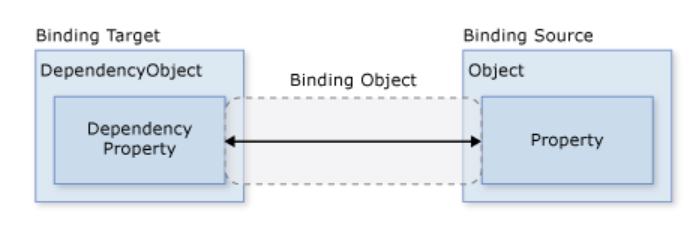
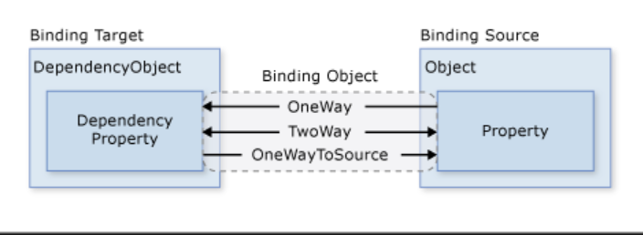
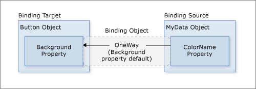
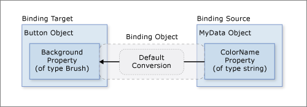
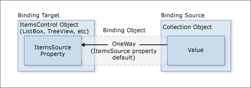
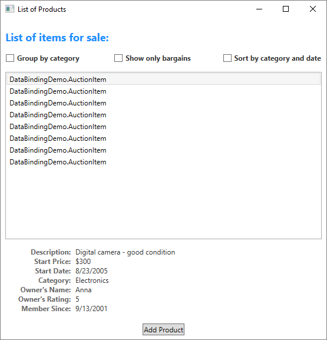
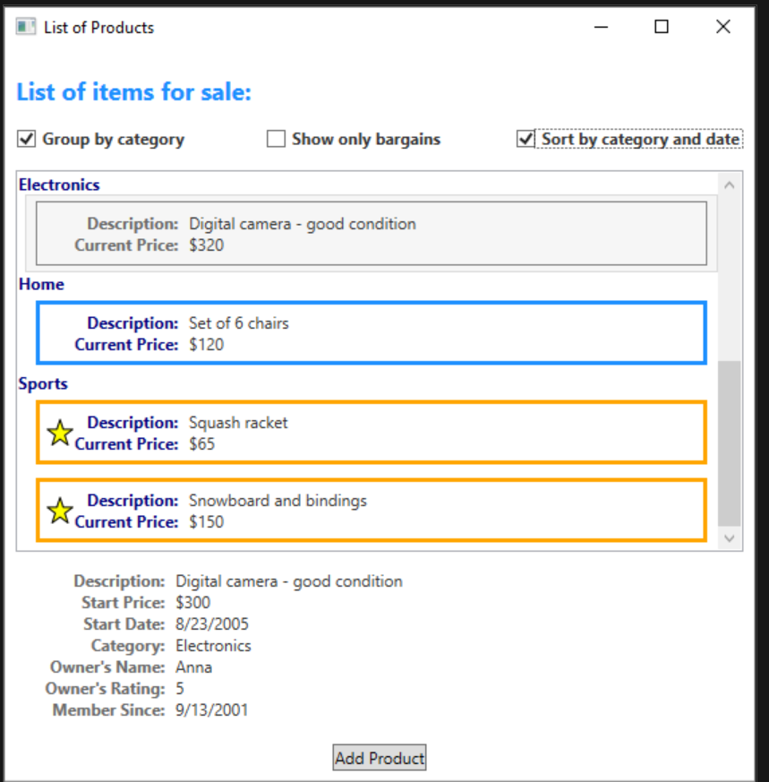
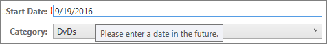
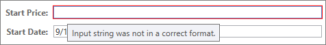

# 数据绑定

## 概述

-  WPF中的数据绑定为应用呈现数据并与数据交互提供了一种简单而一致的方法。 元素能够以 .NET 对象和 XML 的形式绑定到不同类型的数据源中的数据
-  所有 [ContentControl](https://docs.microsoft.com/zh-cn/dotnet/api/system.windows.controls.contentcontrol)（例如 [Button](https://docs.microsoft.com/zh-cn/dotnet/api/system.windows.controls.button)）以及所有 [ItemsControl](https://docs.microsoft.com/zh-cn/dotnet/api/system.windows.controls.itemscontrol)（例如 [ListBox](https://docs.microsoft.com/zh-cn/dotnet/api/system.windows.controls.listbox) 和 [ListView](https://docs.microsoft.com/zh-cn/dotnet/api/system.windows.controls.listview)）都具有内置功能，使单个数据项或数据项集合可以灵活地进行样式设置。 可基于数据生成排序、筛选和分组视图。

- WPF 中的数据绑定与传统模型相比具有几个优点，包括本质上支持数据绑定的大量属性、灵活的数据 UI 表示形式以及业务逻辑与 UI 的完全分离。

## 什么是数据绑定？

- 数据绑定是在应用 UI 与其显示的数据之间建立连接的过程。 如果绑定具有正确的设置，并且数据提供适当的通知，则在数据更改其值时，绑定到该数据的元素会自动反映更改。 数据绑定还意味着，如果元素中数据的外部表示形式发生更改，则基础数据可以自动进行更新以反映更改。
  - 例如，如果用户编辑 `TextBox` 元素中的值，则基础数据值会自动更新以反映该更改。
- 不论要绑定什么元素，也不论数据源是什么性质，每个绑定都始终遵循下图所示的模型
  - 
  - Binding Object(数据绑定) 实质上是绑定目标与绑定源之间的桥梁
  - 每个绑定具有四个组件
    - 绑定目标对象
      - TextBox
    - 目标属性
      - text
      - 必须为依赖属性（DependencyObject）
    - 绑定源
      - Employee
    - 指向绑定源中要使用的值的路径
      - Name (Employ.name)
  - 数据源不限于自定义.NET对象
    - 也可以UIElement、任何列表对象

## 绑定上下文（DataContext）

- 数据上下文通常是绑定源值路径评估的绑定源对象。 可以在绑定中重写此行为，并设置特定的绑定源对象值。 如果未设置承载绑定的对象的 `DataContext` 属性，则将检查父元素的 `DataContext` 属性，依此类推，直到 XAML 对象树的根。 简而言之，除非在对象上显式设置，否则用于解析绑定的数据上下文将继承自父级。

- 绑定可以配置为使用特定的对象进行解析，而不是使用数据上下文进行绑定解析。 
  - 例如，在将对象的前景色绑定到另一个对象的背景色时，将使用直接指定源对象。 无需数据上下文，因为绑定在这两个对象之间解析。 相反，未绑定到特定源对象的绑定使用数据上下文解析。
- 当 `DataContext` 属性发生更改时，重新评估可能会受数据上下文影响的所有绑定。

## 数据流方向

- 绑定的数据流可以从绑定目标流向绑定源（例如，当用户编辑 `TextBox` 的值时，源值会发生更改）和/或（在绑定源提供正确通知的情况下）从绑定源流向绑定目标（例如，`TextBox` 内容会随绑定源中的更改而进行更新）。

- 你可能希望应用允许用户更改数据，然后将该数据传播回源对象。 或者，可能不希望允许用户更新源数据。 可以通过设置 [Binding.Mode](https://docs.microsoft.com/zh-cn/dotnet/api/system.windows.data.binding.mode#system-windows-data-binding-mode) 来控制数据流。

此图演示了不同类型的数据流：



-  [OneWay](https://docs.microsoft.com/zh-cn/dotnet/api/system.windows.data.bindingmode#system-windows-data-bindingmode-oneway)
  - 对源属性的更改会自动更新目标属性，但对目标属性的更改不会传播回源属性。
    -  如果无需监视目标属性的更改，则使用 [OneWay](https://docs.microsoft.com/zh-cn/dotnet/api/system.windows.data.bindingmode#system-windows-data-bindingmode-oneway) 绑定模式可避免 [TwoWay](https://docs.microsoft.com/zh-cn/dotnet/api/system.windows.data.bindingmode#system-windows-data-bindingmode-twoway) 绑定模式的系统开销。

- [TwoWay](https://docs.microsoft.com/zh-cn/dotnet/api/system.windows.data.bindingmode#system-windows-data-bindingmode-twoway) 绑定
  - 更改源属性或目标属性时会自动更新另一方。
  -  此类型的绑定适用于可编辑窗体或其他完全交互式 UI 方案。 大多数属性默认为 [OneWay](https://docs.microsoft.com/zh-cn/dotnet/api/system.windows.data.bindingmode#system-windows-data-bindingmode-oneway) 绑定，但某些依赖属性（通常为用户可编辑控件的属性，例如 [TextBox.Text](https://docs.microsoft.com/zh-cn/dotnet/api/system.windows.controls.textbox.text#system-windows-controls-textbox-text) 和 [CheckBox.IsChecked](https://docs.microsoft.com/zh-cn/dotnet/api/system.windows.controls.primitives.togglebutton.ischecked#system-windows-controls-primitives-togglebutton-ischecked)）默认为 [TwoWay](https://docs.microsoft.com/zh-cn/dotnet/api/system.windows.data.bindingmode#system-windows-data-bindingmode-twoway) 绑定。 
  - 用于确定依赖属性绑定在默认情况下是单向还是双向的编程方法是：使用 [DependencyProperty.GetMetadata](https://docs.microsoft.com/zh-cn/dotnet/api/system.windows.dependencyproperty.getmetadata) 获取属性元数据，然后检查 [FrameworkPropertyMetadata.BindsTwoWayByDefault](https://docs.microsoft.com/zh-cn/dotnet/api/system.windows.frameworkpropertymetadata.bindstwowaybydefault) 属性的布尔值。
- [OneWayToSource](https://docs.microsoft.com/zh-cn/dotnet/api/system.windows.data.bindingmode#system-windows-data-bindingmode-onewaytosource) 
  - [OneWayToSource](https://docs.microsoft.com/zh-cn/dotnet/api/system.windows.data.bindingmode#system-windows-data-bindingmode-onewaytosource) 绑定与 [OneWay](https://docs.microsoft.com/zh-cn/dotnet/api/system.windows.data.bindingmode#system-windows-data-bindingmode-oneway) 绑定相反；当目标属性(text)更改时，它会更新源属性(Employ.name)。
- [OneTime](https://docs.microsoft.com/zh-cn/dotnet/api/system.windows.data.bindingmode#system-windows-data-bindingmode-onetime) 
  - 绑定未在图中显示，该绑定会使源属性初始化目标属性，但不传播后续更改。 如果数据上下文发生更改，或者数据上下文中的对象发生更改，则更改*不会*在目标属性中反映。 此模式实质上是 [OneWay](https://docs.microsoft.com/zh-cn/dotnet/api/system.windows.data.bindingmode#system-windows-data-bindingmode-oneway) 绑定的一种简化形式，它在源值不更改的情况下提供更好的性能。

## 触发源更新的因素

- 与 [Mode](https://docs.microsoft.com/zh-cn/dotnet/api/system.windows.data.binding.mode) 属性类似，不同的依赖属性具有不同的默认 [UpdateSourceTrigger](https://docs.microsoft.com/zh-cn/dotnet/api/system.windows.data.binding.updatesourcetrigger) 值。 大多数依赖属性的默认值为 [PropertyChanged](https://docs.microsoft.com/zh-cn/dotnet/api/system.windows.data.updatesourcetrigger#system-windows-data-updatesourcetrigger-propertychanged)，这将导致源属性的值在目标属性值更改时立即更改。 即时更改适用于 [CheckBox](https://docs.microsoft.com/zh-cn/dotnet/api/system.windows.controls.checkbox) 和其他简单控件。 但对于文本字段，每次击键后都进行更新会降低性能，用户也没有机会在提交新值之前使用 Backspace 键修改键入错误。 例如，`TextBox.Text` 属性默认为 [LostFocus](https://docs.microsoft.com/zh-cn/dotnet/api/system.windows.data.updatesourcetrigger#system-windows-data-updatesourcetrigger-lostfocus) 的 `UpdateSourceTrigger` 值，这会导致源值仅在控件元素失去焦点时（而不是在 `TextBox.Text` 属性更改时）更改。 有关如何查找依赖属性的默认值的信息，请参阅 [UpdateSourceTrigger](https://docs.microsoft.com/zh-cn/dotnet/api/system.windows.data.binding.updatesourcetrigger) 属性页。

- 下表以 [TextBox](https://docs.microsoft.com/zh-cn/dotnet/api/system.windows.controls.textbox) 为例，提供每个 [UpdateSourceTrigger](https://docs.microsoft.com/zh-cn/dotnet/api/system.windows.data.binding.updatesourcetrigger) 值的示例方案。

- | UpdateSourceTrigger 值                                       | 源值更新时间                                                 | TextBox 的示例方案                                           |
  | :----------------------------------------------------------- | :----------------------------------------------------------- | :----------------------------------------------------------- |
  | `LostFocus`（[TextBox.Text](https://docs.microsoft.com/zh-cn/dotnet/api/system.windows.controls.textbox.text) 的默认值） | TextBox 控件失去焦点时。                                     | 与验证逻辑关联的 TextBox（请参阅下文的[数据验证](https://docs.microsoft.com/zh-cn/dotnet/desktop/wpf/data/?view=netdesktop-6.0#data-validation)）。 |
  | `PropertyChanged`                                            | 键入 [TextBox](https://docs.microsoft.com/zh-cn/dotnet/api/system.windows.controls.textbox) 时。 | 聊天室窗口中的 TextBox 控件。                                |
  | `Explicit`                                                   | 应用调用 [UpdateSource](https://docs.microsoft.com/zh-cn/dotnet/api/system.windows.data.bindingexpression.updatesource) 时。 | 可编辑窗体中的 TextBox 控件（仅当用户按“提交”按钮时才更新源值）。 |

## 创建绑定

- 绑定源绑定到元素的活动 [DataContext](https://docs.microsoft.com/zh-cn/dotnet/api/system.windows.frameworkelement.datacontext)。 如果元素没有显式定义 `DataContext`，则会自动继承。

- 请考虑以下示例，其中的绑定源对象是一个名为 *MyData* 的类，该类在 *SDKSample* 命名空间中定义。 出于演示目的，*MyData* 具有名为 *ColorName* 的字符串属性，其值设置为“Red”。 因此，此示例生成一个具有红色背景的按钮。

  ```xaml
  <DockPanel xmlns="http://schemas.microsoft.com/winfx/2006/xaml/presentation"
             xmlns:x="http://schemas.microsoft.com/winfx/2006/xaml"
             xmlns:c="clr-namespace:SDKSample">
      <DockPanel.Resources>
          <c:MyData x:Key="myDataSource"/>
      </DockPanel.Resources>
      <DockPanel.DataContext>
          <Binding Source="{StaticResource myDataSource}"/>
      </DockPanel.DataContext>
      <Button Background="{Binding Path=ColorName}"
              Width="150" Height="30">
          I am bound to be RED!
      </Button>
  </DockPanel>
  ```

  

- 如果将此示例应用于基本关系图，则生成的图如下所示。 此图描述 [OneWay](https://docs.microsoft.com/zh-cn/dotnet/api/system.windows.data.bindingmode#system-windows-data-bindingmode-oneway) 绑定，因为 Background 属性默认支持 [OneWay](https://docs.microsoft.com/zh-cn/dotnet/api/system.windows.data.bindingmode#system-windows-data-bindingmode-oneway) 绑定。

  

  你可能会想知道，此绑定为何在 *ColorName* 属性的类型为字符串而 [Background](https://docs.microsoft.com/zh-cn/dotnet/api/system.windows.controls.control.background) 属性的类型为 [Brush](https://docs.microsoft.com/zh-cn/dotnet/api/system.windows.media.brush) 的情况下也会起作用。 此绑定使用默认类型转换，这会在**数据转换**部分中进行讨论。

## 制定绑定源

- 在前面的示例中，通过设置 [DockPanel.DataContext](https://docs.microsoft.com/zh-cn/dotnet/api/system.windows.frameworkelement.datacontext#system-windows-frameworkelement-datacontext) 属性指定绑定源。 然后，[Button](https://docs.microsoft.com/zh-cn/dotnet/api/system.windows.controls.button) 从其父元素 [DockPanel](https://docs.microsoft.com/zh-cn/dotnet/api/system.windows.controls.dockpanel) 继承 [DataContext](https://docs.microsoft.com/zh-cn/dotnet/api/system.windows.frameworkelement.datacontext) 值。 

- 重申一下，绑定源对象是绑定的四个必需组件之一。 所以，如果未指定绑定源对象，则绑定将没有任何作用。

- 可通过多种方法指定绑定源对象。 

  - 将多个属性绑定到同一个源时，可以使用父元素上的 [DataContext](https://docs.microsoft.com/zh-cn/dotnet/api/system.windows.frameworkelement.datacontext) 属性。 
  - 不过，有时在个别绑定声明中指定绑定源可能更为合适。 对于前面的示例，不使用 [DataContext](https://docs.microsoft.com/zh-cn/dotnet/api/system.windows.frameworkelement.datacontext) 属性，而是通过在按钮的绑定声明中直接设置 [Binding.Source](https://docs.microsoft.com/zh-cn/dotnet/api/system.windows.data.binding.source) 属性来指定绑定源，如以下示例所示。

  ```xaml
  <DockPanel xmlns="http://schemas.microsoft.com/winfx/2006/xaml/presentation"
             xmlns:x="http://schemas.microsoft.com/winfx/2006/xaml"
             xmlns:c="clr-namespace:SDKSample">
      <DockPanel.Resources>
          <c:MyData x:Key="myDataSource"/>
      </DockPanel.Resources>
      <Button Background="{Binding Source={StaticResource myDataSource}, Path=ColorName}"
              Width="150" Height="30">
          I am bound to be RED!
      </Button>
  </DockPanel>
  ```

  - 除直接在元素中设置 [DataContext](https://docs.microsoft.com/zh-cn/dotnet/api/system.windows.frameworkelement.datacontext) 属性、从上级元素（例如第一个示例中的按钮）继承 [DataContext](https://docs.microsoft.com/zh-cn/dotnet/api/system.windows.frameworkelement.datacontext) 值以及通过在绑定上设置 [Binding.Source](https://docs.microsoft.com/zh-cn/dotnet/api/system.windows.data.binding.source) 属性（例如最后一个示例中的按钮）来显式指定绑定源外，你还可以使用 [Binding.ElementName](https://docs.microsoft.com/zh-cn/dotnet/api/system.windows.data.binding.elementname#system-windows-data-binding-elementname) 属性或 [Binding.RelativeSource](https://docs.microsoft.com/zh-cn/dotnet/api/system.windows.data.binding.relativesource#system-windows-data-binding-relativesource) 属性指定绑定源。 当绑定到应用中的其他元素时（例如，使用滑块调整按钮的宽度时），[ElementName](https://docs.microsoft.com/zh-cn/dotnet/api/system.windows.data.binding.elementname) 属性非常有用。

## 制定绑定源的路径

- 虽然我们已强调要使用的值的 [Path](https://docs.microsoft.com/zh-cn/dotnet/api/system.windows.data.binding.path) 是绑定的四个必需组件之一，但在要绑定到整个对象的方案中，要使用的值会与绑定源对象相同。 在这些情况下，可以不指定 [Path](https://docs.microsoft.com/zh-cn/dotnet/api/system.windows.data.binding.path)。 请看下面的示例。

  ```xaml
  <ListBox ItemsSource="{Binding}"
           IsSynchronizedWithCurrentItem="true"/>
  ```

  以上示例使用空绑定语法：{Binding}。 在此示例中，[ListBox](https://docs.microsoft.com/zh-cn/dotnet/api/system.windows.controls.listbox) 从父 DockPanel 元素继承 DataContext（此示例中未显示）。 未指定路径时，默认为绑定到整个对象。 换句话说，此示例中的路径已省略，因为要将 [ItemsSource](https://docs.microsoft.com/zh-cn/dotnet/api/system.windows.controls.itemscontrol.itemssource) 属性绑定到整个对象。


## Binding和BindingExpression

- 举例来说，假设 `myDataObject` 是 `MyData` 类的实例，`myBinding` 是源 [Binding](https://docs.microsoft.com/zh-cn/dotnet/api/system.windows.data.binding) 对象，而 `MyData` 是包含名为 `ColorName` 的字符串属性的定义类。 此示例将 [TextBlock](https://docs.microsoft.com/zh-cn/dotnet/api/system.windows.controls.textblock) 的实例 `myText` 的文本内容绑定到 `ColorName`。

  ```csharp
  // Make a new source
  var myDataObject = new MyData();
  var myBinding = new Binding("ColorName") //BindingExpression
  {
      Source = myDataObject
  };
  
  // Bind the data source to the TextBox control's Text dependency property
  myText.SetBinding(TextBlock.TextProperty, myBinding);
  ```

  - 可以使用同一 *myBinding* 对象来创建其他绑定。 例如，可使用 myBinding 对象将复选框的文本内容绑定到 ColorName 。 在该方案中，将有两个 [BindingExpression](https://docs.microsoft.com/zh-cn/dotnet/api/system.windows.data.bindingexpression) 实例共享 *myBinding* 对象。

  - 通过对数据绑定对象调用 [GetBindingExpression](https://docs.microsoft.com/zh-cn/dotnet/api/system.windows.data.bindingoperations.getbindingexpression) 来返回 [BindingExpression](https://docs.microsoft.com/zh-cn/dotnet/api/system.windows.data.bindingexpression) 对象。 以下文章演示了 [BindingExpression](https://docs.microsoft.com/zh-cn/dotnet/api/system.windows.data.bindingexpression) 类的一些用法：
    - [从绑定目标属性获取绑定对象 (.NET Framework)](https://docs.microsoft.com/zh-cn/dotnet/desktop/wpf/data/how-to-get-the-binding-object-from-a-bound-target-property?view=netdesktop-6.0)
    - [控制 TextBox 文本更新源的时间 (.NET Framework)](https://docs.microsoft.com/zh-cn/dotnet/desktop/wpf/data/how-to-control-when-the-textbox-text-updates-the-source?view=netdesktop-6.0)

## 数据转换

- 在[创建绑定](https://docs.microsoft.com/zh-cn/dotnet/desktop/wpf/data/?view=netdesktop-6.0#create-a-binding)部分，该按钮为红色，因为其 [Background](https://docs.microsoft.com/zh-cn/dotnet/api/system.windows.controls.control.background) 属性绑定到值为“Red”的字符串属性。 此字符串值有效是因为 [Brush](https://docs.microsoft.com/zh-cn/dotnet/api/system.windows.media.brush) 类型中存在类型转换器，可用于将字符串值转换为 [Brush](https://docs.microsoft.com/zh-cn/dotnet/api/system.windows.media.brush)。

  

  但是，如果绑定源对象拥有的不是字符串类型的属性，而是 [Color](https://docs.microsoft.com/zh-cn/dotnet/api/system.windows.media.color) 类型的 *Color* 属性，该怎么办？ 在这种情况下，为了使绑定正常工作，首先需要将 *Color* 属性值转换为 [Background](https://docs.microsoft.com/zh-cn/dotnet/api/system.windows.controls.control.background) 属性可接受的值。 需要通过实现 [IValueConverter](https://docs.microsoft.com/zh-cn/dotnet/api/system.windows.data.ivalueconverter) 接口来创建一个自定义转换器，如以下示例所示。

  ```csharp
  [ValueConversion(typeof(Color), typeof(SolidColorBrush))]
  public class ColorBrushConverter : IValueConverter
  {
      public object Convert(object value, Type targetType, object parameter, System.Globalization.CultureInfo culture)
      {
          Color color = (Color)value;
          return new SolidColorBrush(color);
      }
  
      public object ConvertBack(object value, Type targetType, object parameter, System.Globalization.CultureInfo culture)
      {
          return null;
      }
  }
  ```

  有关更多信息，请参见[IValueConverter](https://docs.microsoft.com/zh-cn/dotnet/api/system.windows.data.ivalueconverter)。

  现在，使用的是自定义转换器而不是默认转换，关系图如下所示。

  

  重申一下，由于要绑定到的类型中提供了类型转换器，因此可以使用默认转换。 此行为取决于目标中可用的类型转换器。 如果无法确定，请创建自己的转换器。

  下面提供了一些典型方案，在这些方案中，实现数据转换器非常有意义：

  - 数据应根据区域性以不同方式显示。 例如，可能需要根据在特定区域性中使用的约定，实现货币转换器或日历日期/时间转换器。
  - 使用的数据不一定会更改属性的文本值，但会更改其他某个值（如图像的源，或显示文本的颜色或样式）。 在这种情况下，可以通过转换可能不合适的属性绑定（如将文本字段绑定到表单元格的 Background 属性）来使用转换器。
  - 多个控件或控件的多个属性会绑定到相同数据。 在这种情况下，主绑定可能仅显示文本，而其他绑定则处理特定的显示问题，但仍使用同一绑定作为源信息。
  - 目标属性具有绑定集合，称为 [MultiBinding](https://docs.microsoft.com/zh-cn/dotnet/api/system.windows.data.multibinding)。 对于 [MultiBinding](https://docs.microsoft.com/zh-cn/dotnet/api/system.windows.data.multibinding)，使用自定义 [IMultiValueConverter](https://docs.microsoft.com/zh-cn/dotnet/api/system.windows.data.imultivalueconverter) 从绑定的值中生成最终值。 例如，可以从红色、蓝色和绿色的值来计算颜色，这些值可能来自相同绑定源对象，也可能来自不同绑定源对象。 有关示例和信息，请参阅 [MultiBinding](https://docs.microsoft.com/zh-cn/dotnet/api/system.windows.data.multibinding)。

## 绑定到集合

- 绑定源对象可以被视为其属性包含数据的单个对象，也可以被视为通常组合在一起的多态对象的数据集合（例如数据库查询的结果）。 目前为止，我们仅讨论了绑定到单个对象， 但绑定到数据集合也是常见方案。 例如，一种常见方案是使用 [ItemsControl](https://docs.microsoft.com/zh-cn/dotnet/api/system.windows.controls.itemscontrol)（例如 [ListBox](https://docs.microsoft.com/zh-cn/dotnet/api/system.windows.controls.listbox)、[ListView](https://docs.microsoft.com/zh-cn/dotnet/api/system.windows.controls.listview) 或 [TreeView](https://docs.microsoft.com/zh-cn/dotnet/api/system.windows.controls.treeview)）来显示数据集合

  

  如图所示，若要将 [ItemsControl](https://docs.microsoft.com/zh-cn/dotnet/api/system.windows.controls.itemscontrol) 绑定到集合对象，则需要使用 [ItemsControl.ItemsSource](https://docs.microsoft.com/zh-cn/dotnet/api/system.windows.controls.itemscontrol.itemssource) 属性。 你可以将 `ItemsSource` 视为 [ItemsControl](https://docs.microsoft.com/zh-cn/dotnet/api/system.windows.controls.itemscontrol) 的内容。 绑定为 [OneWay](https://docs.microsoft.com/zh-cn/dotnet/api/system.windows.data.bindingmode#system-windows-data-bindingmode-oneway)，因为 `ItemsSource` 属性默认支持 `OneWay` 绑定。

- 你可以枚举实现 [IEnumerable](https://docs.microsoft.com/zh-cn/dotnet/api/system.collections.ienumerable) 接口的任何集合。 但是，若要设置动态绑定，以便集合中的插入或删除操作可以自动更新 UI，则集合必须实现 [INotifyCollectionChanged](https://docs.microsoft.com/zh-cn/dotnet/api/system.collections.specialized.inotifycollectionchanged) 接口。 此接口公开一个事件，只要基础集合发生更改，就应该引发该事件
- WPF 提供 [ObservableCollection](https://docs.microsoft.com/zh-cn/dotnet/api/system.collections.objectmodel.observablecollection-1) 类，该类是公开 [INotifyCollectionChanged](https://docs.microsoft.com/zh-cn/dotnet/api/system.collections.specialized.inotifycollectionchanged) 接口的数据集合的内置实现。 若要完全支持将数据值从源对象传输到目标，支持可绑定属性的集合中的每个对象还必须实现 [INotifyPropertyChanged](https://docs.microsoft.com/zh-cn/dotnet/api/system.componentmodel.inotifypropertychanged) 接口。 
- 在实现自己的集合前，请考虑使用 [ObservableCollection](https://docs.microsoft.com/zh-cn/dotnet/api/system.collections.objectmodel.observablecollection-1) 或现有集合类之一，例如 [List](https://docs.microsoft.com/zh-cn/dotnet/api/system.collections.generic.list-1)、[Collection](https://docs.microsoft.com/zh-cn/dotnet/api/system.collections.objectmodel.collection-1) 和 [BindingList](https://docs.microsoft.com/zh-cn/dotnet/api/system.componentmodel.bindinglist-1) 等。 如果有高级方案并且希望实现自己的集合，请考虑使用 [IList](https://docs.microsoft.com/zh-cn/dotnet/api/system.collections.ilist)，它提供可以按索引逐个访问的对象的非泛型集合，因而可提供最佳性能。

## 集合视图

- 集合视图这一层基于绑定源集合，它允许基于排序、筛选和分组查询来导航并显示源集合，而无需更改基础源集合本身。 集合视图还维护一个指向集合中当前项的指针。 如果源集合实现 [INotifyCollectionChanged](https://docs.microsoft.com/zh-cn/dotnet/api/system.collections.specialized.inotifycollectionchanged) 接口，则 [CollectionChanged](https://docs.microsoft.com/zh-cn/dotnet/api/system.collections.specialized.inotifycollectionchanged.collectionchanged) 事件引发的更改会传播到视图。

  由于视图不会更改基础源集合，因此每个源集合都可以有多个关联的视图

  -  使用视图，可以通过不同方式显示相同数据。 例如，可能希望在页面左侧显示按优先级排序的任务，而在页面右侧显示按区域分组的任务。

- 创建视图

  - 创建并使用视图的一种方式是直接实例化视图对象，然后将它用作绑定源。 

  - 将 [ListBox](https://docs.microsoft.com/zh-cn/dotnet/api/system.windows.controls.listbox) 绑定到基于数据集合的视图，而不是直接绑定到数据集合

    ```xaml
    <Window.Resources>
        <CollectionViewSource 
          Source="{Binding Source={x:Static Application.Current}, Path=AuctionItems}"   
          x:Key="listingDataView" />//视图
    </Window.Resources>
    ```

    资源 *listingDataView* 随后用作应用中元素（例如 [ListBox](https://docs.microsoft.com/zh-cn/dotnet/api/system.windows.controls.listbox)）的绑定源。

    ```xaml
    <ListBox Name="Master" Grid.Row="2" Grid.ColumnSpan="3" Margin="8" 
             ItemsSource="{Binding Source={StaticResource listingDataView}}" />
    ```

    若要为同一集合创建另一个视图，则可以创建另一个 [CollectionViewSource](https://docs.microsoft.com/zh-cn/dotnet/api/system.windows.data.collectionviewsource) 实例，并为其提供不同的 `x:Key` 名称。可以在不同的listbox中显示相同数据的不同排序 方式

    ```xaml
    <Window.Resources>
        <CollectionViewSource 
          Source="{Binding Source={x:Static Application.Current}, Path=AuctionItems}" 
          x:Key="listingDataView2" />
    </Window.Resources>
    <ListBox Name="Master" Grid.Row="2" Grid.ColumnSpan="3" Margin="8" 
             ItemsSource="{Binding Source={StaticResource listingDataView2}}" />
    ```

### 排序

- ```c#
  private void AddSortCheckBox_Checked(object sender, RoutedEventArgs e)
  {
      // Sort the items first by Category and then by StartDate
      listingDataView.SortDescriptions.Add(new SortDescription("Category", ListSortDirection.Ascending));
      listingDataView.SortDescriptions.Add(new SortDescription("StartDate", ListSortDirection.Ascending));
  }
  ```

### 筛选

- 视图还可以将筛选器应用于集合，以便视图仅显示完整集合的特定子集。 可以根据条件在数据中进行筛选。 

  ```csharp
  private void AddFilteringCheckBox_Checked(object sender, RoutedEventArgs e)
  {
      if (((CheckBox)sender).IsChecked == true)
          listingDataView.Filter += ListingDataView_Filter;
      else
          listingDataView.Filter -= ListingDataView_Filter;
  }
  ```

  ```csharp
  private void ListingDataView_Filter(object sender, FilterEventArgs e)
  {
      // Start with everything excluded
      e.Accepted = false;
  
      // Only inlcude items with a price less than 25
      if (e.Item is AuctionItem product && product.CurrentPrice < 25)
          e.Accepted = true;
  }
  ```

  如果直接使用其中一个 [CollectionView](https://docs.microsoft.com/zh-cn/dotnet/api/system.windows.data.collectionview) 类而不是 [CollectionViewSource](https://docs.microsoft.com/zh-cn/dotnet/api/system.windows.data.collectionviewsource)，则可以使用 [Filter](https://docs.microsoft.com/zh-cn/dotnet/api/system.windows.data.collectionview.filter) 属性指定回叫。 有关示例，请参阅[筛选视图中的数据 (.NET Framework)](https://docs.microsoft.com/zh-cn/dotnet/desktop/wpf/data/how-to-filter-data-in-a-view?view=netdesktop-6.0)。

### 分组

- ```c#
  // This groups the items in the view by the property "Category"
  var groupDescription = new PropertyGroupDescription();
  groupDescription.PropertyName = "Category";
  listingDataView.GroupDescriptions.Add(groupDescription);
  ```

### 当前项指针

-  绑定到视图时，`Path` 值中的斜杠（“/”）字符用于指定视图的当前项。 在下面的示例中，数据上下文是一个集合视图。 第一行绑定到集合。 第二行绑定到集合中的当前项。 第三行绑定到集合中当前项的 `Description` 属性。

  XAML复制

  ```xaml
  <Button Content="{Binding }" />
  <Button Content="{Binding Path=/}" />
  <Button Content="{Binding Path=/Description}" />
  ```

  还可以连着使用斜杠和属性语法以遍历集合的分层。 以下示例绑定到一个名为 `Offices` 的集合的当前项，此集合是源集合的当前项的属性。

  XAML复制

  ```xaml
  <Button Content="{Binding /Offices/}" />
  ```

  当前项指针可能会受对集合应用的任何排序或筛选操作的影响。 排序操作将当前项指针保留在所选的最后一项上，但集合视图现已围绕此指针重构。 （或许所选项以前曾位于列表的开头，但现在所选项可能位于中间的某个位置。） 如果所选内容在筛选之后保留在视图中，则筛选操作会保留所选项。 否则，当前项指针会设置为经过筛选的集合视图的第一项。

### 主从绑定方案

- 当前项的概念不仅适用于集合中各项的导航，也适用于主-从绑定方案。 在该应用中，[ListBox](https://docs.microsoft.com/zh-cn/dotnet/api/system.windows.controls.listbox) 中的选择确定 [ContentControl](https://docs.microsoft.com/zh-cn/dotnet/api/system.windows.controls.contentcontrol) 中显示的内容。 换句话说，选择 [ListBox](https://docs.microsoft.com/zh-cn/dotnet/api/system.windows.controls.listbox) 项目时，[ContentControl](https://docs.microsoft.com/zh-cn/dotnet/api/system.windows.controls.contentcontrol) 显示所选项的详细信息。

  只需将两个或更多控件绑定到同一视图即可实现主-从方案。 [数据绑定演示](https://github.com/microsoft/WPF-Samples/tree/master/Sample Applications/DataBindingDemo)中的以下示例演示了在[什么是数据绑定](https://docs.microsoft.com/zh-cn/dotnet/desktop/wpf/data/?view=netdesktop-6.0#what-is-data-binding)部分中的应用 UI 上看到的 [ListBox](https://docs.microsoft.com/zh-cn/dotnet/api/system.windows.controls.listbox) 和 [ContentControl](https://docs.microsoft.com/zh-cn/dotnet/api/system.windows.controls.contentcontrol) 的标记。

  ```xaml
  <ListBox Name="Master" Grid.Row="2" Grid.ColumnSpan="3" Margin="8" 
           ItemsSource="{Binding Source={StaticResource listingDataView}}" />
  <ContentControl Name="Detail" Grid.Row="3" Grid.ColumnSpan="3"
                  Content="{Binding Source={StaticResource listingDataView}}"
                  ContentTemplate="{StaticResource detailsProductListingTemplate}" 
                  Margin="9,0,0,0"/>
  ```

  请注意，这两个控件都绑定到同一个源，即 *listingDataView* 静态资源。 此绑定有效是因为将单一实例对象（在本例中为 [ContentControl](https://docs.microsoft.com/zh-cn/dotnet/api/system.windows.controls.contentcontrol)）绑定到集合视图时，它会自动绑定到该视图的 [CurrentItem](https://docs.microsoft.com/zh-cn/dotnet/api/system.windows.data.collectionview.currentitem)。 [CollectionViewSource](https://docs.microsoft.com/zh-cn/dotnet/api/system.windows.data.collectionviewsource) 对象会自动同步货币和选择。 如果列表控件未像本示例中那样绑定到 [CollectionViewSource](https://docs.microsoft.com/zh-cn/dotnet/api/system.windows.data.collectionviewsource) 对象，则需要将其 [IsSynchronizedWithCurrentItem](https://docs.microsoft.com/zh-cn/dotnet/api/system.windows.controls.primitives.selector.issynchronizedwithcurrentitem) 属性设置为 `true` 才能起作用。

  你可能已经注意到上述示例使用了一个模板。 实际上，如果不使用模板（[ContentControl](https://docs.microsoft.com/zh-cn/dotnet/api/system.windows.controls.contentcontrol) 显式使用的模板以及 [ListBox](https://docs.microsoft.com/zh-cn/dotnet/api/system.windows.controls.listbox) 隐式使用的模板），数据不会按照我们希望的方式显示。

## 数据模板化

- 如果不使用数据模板，[数据绑定示例](https://docs.microsoft.com/zh-cn/dotnet/desktop/wpf/data/?view=netdesktop-6.0#example-of-data-binding)部分中的应用 UI 将如下所示：

  

  如前面部分中的示例所示，[ListBox](https://docs.microsoft.com/zh-cn/dotnet/api/system.windows.controls.listbox) 控件和 [ContentControl](https://docs.microsoft.com/zh-cn/dotnet/api/system.windows.controls.contentcontrol) 都绑定到 *AuctionItem* 的整个集合对象（更具体地说，是绑定到集合对象视图）。 如果未提供如何显示数据集合的特定说明，则 [ListBox](https://docs.microsoft.com/zh-cn/dotnet/api/system.windows.controls.listbox) 会以字符串形式显示基础集合中的每个对象，[ContentControl](https://docs.microsoft.com/zh-cn/dotnet/api/system.windows.controls.contentcontrol) 会以字符串形式显示绑定到的对象。

  为了解决该问题，应用定义了 [DataTemplates](https://docs.microsoft.com/zh-cn/dotnet/api/system.windows.datatemplate)。 如前面部分中的示例所示，[ContentControl](https://docs.microsoft.com/zh-cn/dotnet/api/system.windows.controls.contentcontrol) 显式使用 *detailsProductListingTemplate* 数据模板。 显示集合中的 *AuctionItem* 对象时，[ListBox](https://docs.microsoft.com/zh-cn/dotnet/api/system.windows.controls.listbox) 控件隐式使用以下数据模板。

  ```xaml
  <DataTemplate DataType="{x:Type src:AuctionItem}">
      <Border BorderThickness="1" BorderBrush="Gray"
              Padding="7" Name="border" Margin="3" Width="500">
          <Grid>
              <Grid.RowDefinitions>
                  <RowDefinition/>
                  <RowDefinition/>
                  <RowDefinition/>
                  <RowDefinition/>
              </Grid.RowDefinitions>
              <Grid.ColumnDefinitions>
                  <ColumnDefinition Width="20"/>
                  <ColumnDefinition Width="86"/>
                  <ColumnDefinition Width="*"/>
              </Grid.ColumnDefinitions>
  
              <Polygon Grid.Row="0" Grid.Column="0" Grid.RowSpan="4"
                       Fill="Yellow" Stroke="Black" StrokeThickness="1"
                       StrokeLineJoin="Round" Width="20" Height="20"
                       Stretch="Fill"
                       Points="9,2 11,7 17,7 12,10 14,15 9,12 4,15 6,10 1,7 7,7"
                       Visibility="Hidden" Name="star"/>
  
              <TextBlock Grid.Row="0" Grid.Column="1" Margin="0,0,8,0"
                         Name="descriptionTitle"
                         Style="{StaticResource smallTitleStyle}">Description:</TextBlock>
              
              <TextBlock Name="DescriptionDTDataType" Grid.Row="0" Grid.Column="2"
                         Text="{Binding Path=Description}"
                         Style="{StaticResource textStyleTextBlock}"/>
  
              <TextBlock Grid.Row="1" Grid.Column="1" Margin="0,0,8,0"
                         Name="currentPriceTitle"
                         Style="{StaticResource smallTitleStyle}">Current Price:</TextBlock>
              
              <StackPanel Grid.Row="1" Grid.Column="2" Orientation="Horizontal">
                  <TextBlock Text="$" Style="{StaticResource textStyleTextBlock}"/>
                  <TextBlock Name="CurrentPriceDTDataType"
                             Text="{Binding Path=CurrentPrice}" 
                             Style="{StaticResource textStyleTextBlock}"/>
              </StackPanel>
          </Grid>
      </Border>
      <DataTemplate.Triggers>
          <DataTrigger Binding="{Binding Path=SpecialFeatures}">
              <DataTrigger.Value>
                  <src:SpecialFeatures>Color</src:SpecialFeatures>
              </DataTrigger.Value>
              <DataTrigger.Setters>
                  <Setter Property="BorderBrush" Value="DodgerBlue" TargetName="border" />
                  <Setter Property="Foreground" Value="Navy" TargetName="descriptionTitle" />
                  <Setter Property="Foreground" Value="Navy" TargetName="currentPriceTitle" />
                  <Setter Property="BorderThickness" Value="3" TargetName="border" />
                  <Setter Property="Padding" Value="5" TargetName="border" />
              </DataTrigger.Setters>
          </DataTrigger>
          <DataTrigger Binding="{Binding Path=SpecialFeatures}">
              <DataTrigger.Value>
                  <src:SpecialFeatures>Highlight</src:SpecialFeatures>
              </DataTrigger.Value>
              <Setter Property="BorderBrush" Value="Orange" TargetName="border" />
              <Setter Property="Foreground" Value="Navy" TargetName="descriptionTitle" />
              <Setter Property="Foreground" Value="Navy" TargetName="currentPriceTitle" />
              <Setter Property="Visibility" Value="Visible" TargetName="star" />
              <Setter Property="BorderThickness" Value="3" TargetName="border" />
              <Setter Property="Padding" Value="5" TargetName="border" />
          </DataTrigger>
      </DataTemplate.Triggers>
  </DataTemplate>
  ```

  - 

   如屏幕截图所示，除了可以在控件中放置数据以外，使用 DataTemplate 还可以为数据定义引人注目的视觉对象。 例如，上述 [DataTemplate](https://docs.microsoft.com/zh-cn/dotnet/api/system.windows.datatemplate) 中使用了 [DataTrigger](https://docs.microsoft.com/zh-cn/dotnet/api/system.windows.datatrigger)，因而 *SpecialFeatures* 值为 *HighLight* 的 *AuctionItem* 会显示为带有橙色边框和一个星号。

## 数据验证

- 接受用户输入的大多数应用都需要具有验证逻辑，以确保用户输入了预期信息。 可基于类型、范围、格式或特定于应用的其他要求执行验证检查。 

- 验证规则与绑定关联

  - WPF 数据绑定模型允许将 [ValidationRules](https://docs.microsoft.com/zh-cn/dotnet/api/system.windows.data.binding.validationrules) 与 [Binding](https://docs.microsoft.com/zh-cn/dotnet/api/system.windows.data.binding) 对象关联。

    -  例如，以下示例将 [TextBox](https://docs.microsoft.com/zh-cn/dotnet/api/system.windows.controls.textbox) 绑定到名为 `StartPrice` 的属性，并将 [ExceptionValidationRule](https://docs.microsoft.com/zh-cn/dotnet/api/system.windows.controls.exceptionvalidationrule) 对象添加到 [Binding.ValidationRules](https://docs.microsoft.com/zh-cn/dotnet/api/system.windows.data.binding.validationrules) 属性。

      ```xaml
      <TextBox Name="StartPriceEntryForm" Grid.Row="2"
               Style="{StaticResource textStyleTextBox}" Margin="8,5,0,5" Grid.ColumnSpan="2">
          <TextBox.Text>
              <Binding Path="StartPrice" UpdateSourceTrigger="PropertyChanged">
                  <Binding.ValidationRules>
                      <ExceptionValidationRule />
                  </Binding.ValidationRules>
              </Binding>
          </TextBox.Text>
      </TextBox>
      ```

  - [ValidationRule](https://docs.microsoft.com/zh-cn/dotnet/api/system.windows.controls.validationrule) 对象检查属性的值是否有效。 WPF 有两种类型的内置 [ValidationRule](https://docs.microsoft.com/zh-cn/dotnet/api/system.windows.controls.validationrule) 对象：

    - [ExceptionValidationRule](https://docs.microsoft.com/zh-cn/dotnet/api/system.windows.controls.exceptionvalidationrule) 检查在绑定源属性更新期间引发的异常。 在以上示例中，`StartPrice` 为整数类型。 当用户输入的值无法转换为整数时，将引发异常，这会导致将绑定标记为无效。 用于显式设置 [ExceptionValidationRule](https://docs.microsoft.com/zh-cn/dotnet/api/system.windows.controls.exceptionvalidationrule) 的替代语法是在 [Binding](https://docs.microsoft.com/zh-cn/dotnet/api/system.windows.data.binding) 或 [MultiBinding](https://docs.microsoft.com/zh-cn/dotnet/api/system.windows.data.multibinding) 对象上将 [ValidatesOnExceptions](https://docs.microsoft.com/zh-cn/dotnet/api/system.windows.data.binding.validatesonexceptions) 属性设置为 `true`。
    - [DataErrorValidationRule](https://docs.microsoft.com/zh-cn/dotnet/api/system.windows.controls.dataerrorvalidationrule) 对象检查实现 [IDataErrorInfo](https://docs.microsoft.com/zh-cn/dotnet/api/system.componentmodel.idataerrorinfo) 接口的对象所引发的错误。 有关使用此验证规则的详细信息，请参阅 [DataErrorValidationRule](https://docs.microsoft.com/zh-cn/dotnet/api/system.windows.controls.dataerrorvalidationrule)。 用于显式设置 [DataErrorValidationRule](https://docs.microsoft.com/zh-cn/dotnet/api/system.windows.controls.dataerrorvalidationrule) 的替代语法是在 [Binding](https://docs.microsoft.com/zh-cn/dotnet/api/system.windows.data.binding) 或 [MultiBinding](https://docs.microsoft.com/zh-cn/dotnet/api/system.windows.data.multibinding) 对象上将 [ValidatesOnDataErrors](https://docs.microsoft.com/zh-cn/dotnet/api/system.windows.data.binding.validatesondataerrors) 属性设置为 `true`。

  - 还可以通过从 [ValidationRule](https://docs.microsoft.com/zh-cn/dotnet/api/system.windows.controls.validationrule) 类派生并实现 [Validate](https://docs.microsoft.com/zh-cn/dotnet/api/system.windows.controls.validationrule.validate) 方法来创建自己的验证规则。 以下示例演示了[什么是数据绑定](https://docs.microsoft.com/zh-cn/dotnet/desktop/wpf/data/?view=netdesktop-6.0#what-is-data-binding)部分中*添加产品清单*“起始日期”[TextBox](https://docs.microsoft.com/zh-cn/dotnet/api/system.windows.controls.textbox) 所用的规则。

    - ```c#
      public class FutureDateRule : ValidationRule
      {
          public override ValidationResult Validate(object value, CultureInfo cultureInfo)
          {
              // Test if date is valid
              if (DateTime.TryParse(value.ToString(), out DateTime date))
              {
                  // Date is not in the future, fail
                  if (DateTime.Now > date)
                      return new ValidationResult(false, "Please enter a date in the future.");
              }
              else
              {
                  // Date is not a valid date, fail
                  return new ValidationResult(false, "Value is not a valid date.");
              }
      
              // Date is valid and in the future, pass
              return ValidationResult.ValidResult;
          }
      }

  - 

  - *StartDateEntryForm*[TextBox](https://docs.microsoft.com/zh-cn/dotnet/api/system.windows.controls.textbox) 使用此 *FutureDateRule*，如以下示例所示。

    - ```c#
      <TextBox Name="StartDateEntryForm" Grid.Row="3"
               Validation.ErrorTemplate="{StaticResource validationTemplate}" 
               Style="{StaticResource textStyleTextBox}" Margin="8,5,0,5" Grid.ColumnSpan="2">
          <TextBox.Text>
              <Binding Path="StartDate" UpdateSourceTrigger="PropertyChanged" 
                       Converter="{StaticResource dateConverter}" >
                  <Binding.ValidationRules>
                      <src:FutureDateRule />
                  </Binding.ValidationRules>
              </Binding>
          </TextBox.Text>
      </TextBox>
      ```

  

  - 因为 [UpdateSourceTrigger](https://docs.microsoft.com/zh-cn/dotnet/api/system.windows.data.binding.updatesourcetrigger) 值为 [PropertyChanged](https://docs.microsoft.com/zh-cn/dotnet/api/system.windows.data.updatesourcetrigger#system-windows-data-updatesourcetrigger-propertychanged)，所以绑定引擎会在每次击键时更新源值，这意味着它还会在每次击键时检查 [ValidationRules](https://docs.microsoft.com/zh-cn/dotnet/api/system.windows.data.binding.validationrules) 集合中的每条规则。

### 提供视觉反馈

- 如果用户输入的值无效，你可能希望在应用 UI 上提供一些有关错误的反馈。 提供此类反馈的一种方法是将 [Validation.ErrorTemplate](https://docs.microsoft.com/zh-cn/dotnet/api/system.windows.controls.validation.errortemplate) 附加属性设置为自定义 [ControlTemplate](https://docs.microsoft.com/zh-cn/dotnet/api/system.windows.controls.controltemplate)。 如前面部分所示，*StartDateEntryForm*[TextBox](https://docs.microsoft.com/zh-cn/dotnet/api/system.windows.controls.textbox) 使用名为 *validationTemplate* 的 [ErrorTemplate](https://docs.microsoft.com/zh-cn/dotnet/api/system.windows.controls.validation.errortemplate)。 以下示例显示了 *validationTemplate* 的定义。

  XAML复制

  ```xaml
  <ControlTemplate x:Key="validationTemplate">
      <DockPanel>
          <TextBlock Foreground="Red" FontSize="20">!</TextBlock>
          <AdornedElementPlaceholder/>
      </DockPanel>
  </ControlTemplate>
  ```

  [AdornedElementPlaceholder](https://docs.microsoft.com/zh-cn/dotnet/api/system.windows.controls.adornedelementplaceholder) 元素指定应放置待装饰控件的位置。

  此外，还可以使用 [ToolTip](https://docs.microsoft.com/zh-cn/dotnet/api/system.windows.controls.tooltip) 来显示错误消息。 *StartDateEntryForm* 和 *StartPriceEntryForm*[TextBox](https://docs.microsoft.com/zh-cn/dotnet/api/system.windows.controls.textbox) 都使用样式 *textStyleTextBox*，该样式创建显示错误消息的 [ToolTip](https://docs.microsoft.com/zh-cn/dotnet/api/system.windows.controls.tooltip)。 以下示例显示了 *textStyleTextBox* 的定义。 如果绑定元素属性上的一个或多个绑定出错，则附加属性 [Validation.HasError](https://docs.microsoft.com/zh-cn/dotnet/api/system.windows.controls.validation.haserror) 为 `true`。

  XAML复制

  ```xaml
  <Style x:Key="textStyleTextBox" TargetType="TextBox">
      <Setter Property="Foreground" Value="#333333" />
      <Setter Property="MaxLength" Value="40" />
      <Setter Property="Width" Value="392" />
      <Style.Triggers>
          <Trigger Property="Validation.HasError" Value="true">
              <Setter Property="ToolTip" 
                      Value="{Binding (Validation.Errors).CurrentItem.ErrorContent, RelativeSource={RelativeSource Self}}" />
          </Trigger>
      </Style.Triggers>
  </Style>
  ```

  使用自定义 [ErrorTemplate](https://docs.microsoft.com/zh-cn/dotnet/api/system.windows.controls.validation.errortemplate) 和 [ToolTip](https://docs.microsoft.com/zh-cn/dotnet/api/system.windows.controls.tooltip) 时，StartDateEntryForm [TextBox](https://docs.microsoft.com/zh-cn/dotnet/api/system.windows.controls.textbox) 在发生验证错误时如下所示。

  

  如果 [Binding](https://docs.microsoft.com/zh-cn/dotnet/api/system.windows.data.binding) 具有关联的验证规则，但未在绑定控件上指定 [ErrorTemplate](https://docs.microsoft.com/zh-cn/dotnet/api/system.windows.controls.validation.errortemplate)，则发生验证错误时，将使用默认的 [ErrorTemplate](https://docs.microsoft.com/zh-cn/dotnet/api/system.windows.controls.validation.errortemplate) 通知用户。 默认的 [ErrorTemplate](https://docs.microsoft.com/zh-cn/dotnet/api/system.windows.controls.validation.errortemplate) 是一个控件模板，它在装饰层中定义红色边框。 使用默认的 [ErrorTemplate](https://docs.microsoft.com/zh-cn/dotnet/api/system.windows.controls.validation.errortemplate) 和 [ToolTip](https://docs.microsoft.com/zh-cn/dotnet/api/system.windows.controls.tooltip) 时，StartPriceEntryForm [TextBox](https://docs.microsoft.com/zh-cn/dotnet/api/system.windows.controls.textbox) 的 UI 在发生验证错误时如下所示。

  

## 绑定路径语法

[Path](https://docs.microsoft.com/zh-cn/dotnet/api/system.windows.data.binding.path)使用属性指定要绑定到的源值：

- 在最简单的情况下， [Path](https://docs.microsoft.com/zh-cn/dotnet/api/system.windows.data.binding.path) 属性值是要用于绑定的源对象的属性的名称，例如 `Path=PropertyName` 。
- 可以通过类似于 c # 中的类似语法来指定属性的子属性。 例如，子句 `Path=ShoppingCart.Order` 设置与对象或属性 `ShoppingCart` 的子属性 `Order` 的绑定。
- 若要绑定到附加属性，请将附加属性置于括号中。 例如，若要绑定到附加属性 [DockPanel.Dock](https://docs.microsoft.com/zh-cn/dotnet/api/system.windows.controls.dockpanel.dock) ，语法为 `Path=(DockPanel.Dock)` 。
- 可以在已应用索引器的属性名后面的方括号内指定属性的索引器。 例如，子句 `Path=ShoppingCart[0]` 将绑定设置为与属性的内部索引处理文本字符串“0”的方式对应的索引。 还支持嵌套索引器。
- 可以在 `Path` 子句中混用索引器和子属性，例如 `Path=ShoppingCart.ShippingInfo[MailingAddress,Street].`
- 在索引器中。 可以使用逗号分隔的多个索引器参数 (`,`) 。 可以使用括号指定每个参数的类型。 例如，可以使用 `Path="[(sys:Int32)42,(sys:Int32)24]"`，其中 `sys` 将映射到 `System` 命名空间。
- 如果源是集合视图，则可以使用斜杠 (`/`) 来指定当前项。 例如，子句 `Path=/` 设置与视图中当前项的绑定。 如果源是集合，则此语法指定默认集合视图的当前项。
- 可以组合使用属性名和斜杠，以遍历作为集合的属性。 例如，`Path=/Offices/ManagerName` 指定源集合的当前项，源集合中包含的 `Offices` 属性也是一个集合。 它的当前项是一个包含 `ManagerName` 属性的对象。
- 或者，可以使用句点 (`.`) 路径来绑定到当前源。 例如，`Text="{Binding}"` 等效于 `Text="{Binding Path=.}"`。

## 转义机制

- 在索引器 (`[ ]`) 中，插入符号 (`^`) 转义下一个字符。
- 如果在 XAML 中设置 [Path](https://docs.microsoft.com/zh-cn/dotnet/api/system.windows.data.binding.path) ，则还需要使用 xml 实体对 xml 语言定义的特殊字符) 转义 (：
  - 用于 `&` 转义字符 " `&` "。
  - 用于 `>` 转义结束标记 " `>` "。
- 此外，如果使用标记扩展语法描述属性中的整个绑定，则需要使用反斜杠对 WPF 标记扩展分析器专用的反斜杠 `\`) 字符进行转义 (：
  - 反斜杠 (`\`) 本身是转义字符。
  - 等号 (`=`) 将属性名与属性值分隔开。
  - 逗号 (`,`) 用于分隔属性。
  - 右大括号 (`}`) 是标记扩展的结尾。

## 绑定到枚举

- 下面的 XAML 代码表示一个简单的窗口，该窗口执行以下操作：

  1. 将数据源中 [ObjectDataProvider](https://docs.microsoft.com/zh-cn/dotnet/api/system.windows.data.objectdataprovider) 的 [HorizontalAlignment](https://docs.microsoft.com/zh-cn/dotnet/api/system.windows.horizontalalignment) 枚举包装为资源。
  2. 提供一个 [ListBox](https://docs.microsoft.com/zh-cn/dotnet/api/system.windows.controls.listbox) 控件来列出所有枚举值。
  3. [Button](https://docs.microsoft.com/zh-cn/dotnet/api/system.windows.controls.button)将控件的 [HorizontalAlignment](https://docs.microsoft.com/zh-cn/dotnet/api/system.windows.frameworkelement.horizontalalignment#system-windows-frameworkelement-horizontalalignment) 属性绑定到中 `ListBox` 的选定项。

  XAML复制

  ```xaml
  <Window x:Class="ArticleExample.BindEnumFull"
          xmlns="http://schemas.microsoft.com/winfx/2006/xaml/presentation"
          xmlns:x="http://schemas.microsoft.com/winfx/2006/xaml"
          xmlns:sys="clr-namespace:System;assembly=mscorlib" 
          SizeToContent="WidthAndHeight"
          Title="Enum binding">
      <Window.Resources>
          <ObjectDataProvider x:Key="EnumDataSource"
                              ObjectType="{x:Type sys:Enum}"
                              MethodName="GetValues">
              <ObjectDataProvider.MethodParameters>
                  <x:Type TypeName="HorizontalAlignment" />
              </ObjectDataProvider.MethodParameters>
          </ObjectDataProvider>
      </Window.Resources>
      
      <StackPanel Width="300" Margin="10">
          <TextBlock>Choose the HorizontalAlignment value of the Button:</TextBlock>
  
          <ListBox Name="myComboBox" SelectedIndex="0"
                   ItemsSource="{Binding Source={StaticResource EnumDataSource}}"/>
  
          <Button Content="I'm a button"
                  HorizontalAlignment="{Binding ElementName=myComboBox, Path=SelectedItem}" />
      </StackPanel>
  </Window>
  ```

## RelativeSource 绑定

-  Self

  ```xaml
  <TextBlock FontSize="18" FontWeight="Bold" Margin="10"
                   Background="Red" Width="80" Height="{Binding RelativeSource={RelativeSource Self},Path=Width}">MultiBinding Sample</TextBlock>
  ```

  Height设置可以使textbox的width和height相同

- TemplatedParent

例如为一个Button写一个样式，修改Button为椭圆型。同时需要椭圆的背景色和Button的背景色相同。

```c#
<Style TargetType="{x:Type Button}">
            <Setter Property="Background" Value="Green"/>
            <Setter Property="Template">
                <Setter.Value>
                    <ControlTemplate TargetType="{x:Type Button}">
                        <Grid>
                            <Ellipse>
                                <Ellipse.Fill>
                                    <SolidColorBrush Color="{Binding Path=Background.Color,RelativeSource={RelativeSource TemplatedParent}}"/>
                                </Ellipse.Fill>
                            </Ellipse>
                        </Grid>
                    </ControlTemplate>
                </Setter.Value>
            </Setter>
        </Style>
```

　在这个例子中 TemplateParent就是指的Button

 

- AncestorType
  - 指定绑定源为某个父元素
  
  - Label的背景色和Grid的背景色一样。
  
  - ```xaml
    <Grid>
        <Label Background = {Binding Path=Background, RelativeSource={RelativeSource AncestorType={x:Type Grid}}}/>
    </Grid>
    ```

----


摘自[官方文档](https://docs.microsoft.com/zh-cn/dotnet/api/system.windows.data.objectdataprovider?view=windowsdesktop-6.0)

