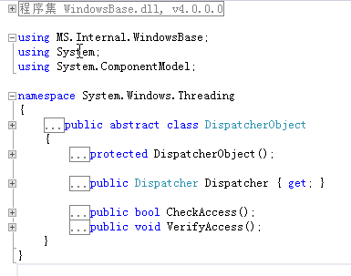

# 一、Dispatcher介绍

   微软在WPF引入了Dispatcher，那么这个Dispatcher的主要作用是什么呢？

   不管是WinForm应用程序还是WPF应用程序，实际上都是一个进程，一个进程可以包含多个线程，其中有一个是主线程，其余的是子线程。在WPF或WinForm应用程序中，主线程负责接收输入、处理事件、绘制屏幕等工作，为了使主线程及时响应，防止假死，在开发过程中对一些耗时的操作、消耗资源比较多的操作，都会去创建一个或多个子线程去完成操作，比如大数据量的循环操作、后台下载。这样一来，由于UI界面是主线程创建的，所以子线程不能直接更新由主线程维护的UI界面。

   Dispatcher的作用是用于管理线程工作项队列，类似于Win32中的消息队列，Dispatcher的内部函数，仍然调用了传统的创建窗口类，创建窗口，建立消息泵等操作。Dispatcher本身是一个单例模式，构造函数私有，暴露了一个静态的CurrentDispatcher方法用于获得当前线程的Dispatcher。对于线程来说，它对Dispatcher是一无所知的，Dispatcher内部维护了一个静态的 List<Dispatcher> _dispatchers, 每当使用CurrentDispatcher方法时，它会在这个_dispatchers中遍历，如果没有找到，则创建一个新的Dispatcher对 象，加入到_dispatchers中去。Dispatcher内部维护了一个Thread的属性，创建Dispatcher时会把当前线程赋值给这个 Thread的属性，下次遍历查找的时候就使用这个字段来匹配是否在_dispatchers中已经保存了当前线程的Dispatcher。

 

# 二、Dispatcher的继承关系

   在 WPF 的类层次结构中，大部分都集中派生于 DispatcherObject 类（通过其他类）。如**下图** 所示，您可以看到 DispatcherObject 虚拟类正好位于 Object 下方和大多数 WPF 类的层次结构之间。 要了解他们之间的关系可以参看下面这张类继承关系图： 

 

对上图的一些说明：

1) System.Object 类：大家都知道在.Net中所有类型的基类,DispatcherObject 就继承于它，所以它是WPF的基类。

2) System.Windows.Threading.DispatcherObject 类：从图中看WPF 中的使用到的大部分控件与其他类大多是继承 DispatcherObject 类，它提供了用于处理并发和线程的基本构造。

3) System.Windows.DependencyObject类：对WPF中的依赖项属性承载支持与 附加属性承载支持，表示参与 依赖项属性 系统的对象。

4) System.Windows.Media.Visual类：为 WPF 中的呈现提供支持，其中包括命中测试、坐标转换和边界框计算等。

5) System.Windows.UIElement 类：UIElement 是 WPF 核心级实现的基类，该类是 Windows Presentation Foundation (WPF) 中具有可视外观并可以处理基本输入的大多数对象的基类。

6) System.Windows.FrameworkElement类：为 Windows Presentation Foundation (WPF) 元素提供 WPF 框架级属性集、事件集和方法集。此类表示附带的 WPF 框架级实现，它是基于由UIElement定义的 WPF 核心级 API 构建的。

7) System.Windows.Controls.Control 类：表示 用户界面 (UI) 元素的基类，这些元素使用 ControlTemplate 来定义其外观。

8) System.Windows.Controls.ContentControl类：表示没有任何类型的内容表示单个控件。

WPF的绝大部分的控件，还包括窗口本身都是继承自ContentControl的。

ContentControl族包含的控件

| Button         | ButtonBase   | CheckBox             | ComboBoxItem     |
| -------------- | ------------ | -------------------- | ---------------- |
| ContentControl | Frame        | GridViewColumnHeader | GroupItem        |
| Label          | ListBoxItem  | ListViewItem         | NavigationWindow |
| RadioButton    | RepeatButton | ScrollViewer         | StatusBarItem    |
| ToggleButton   | ToolTip      | UserControl          | Window           |

 

9) System.Windows.Controls.ItemsControl 类：表示可用于提供项目的集合的控件。 

 以条目集合位内容的控件 ItemsControl

特点： a.均派生自ItemsControl

​			b.内容属性为Items或ItemsSource

​       	 c.每种ItemsControl都对应有自己的条目容器(Item Container).

ItemsControl族包含的控件

| Menu         | MenuBase | ContextMenu | ComboBox   |
| ------------ | -------- | ----------- | ---------- |
| ItemsControl | ListBox  | ListView    | TabControl |
| TreeView     | Selector | StatusBar   |            |

 

10) System.Windows.Controls.Panel类：为所有 Panel 元素提供基类。 使用 Panel 元素定位和排列在 Windows Presentation Foundation (WPF) 应用程序的子对象。
11) System.Windows.Sharps.Sharp类：为 Ellipse、Polygon 和 Rectangle 之类的形状元素提供基类。

 

# 三、走进Dispatcher

   所有 WPF 应用程序启动时都会加载两个重要的线程：一个用于呈现用户界面，另一个用于管理用户界面。呈现线程是一个在后台运行的隐藏线程，因此您通常面对的唯一线程 就是 UI 线程。WPF 要求将其大多数对象与 UI 线程进行关联。这称之为线程关联，意味着要使用一个 WPF 对象，只能在创建它的线程上使用。在其他线程上使用它会导致引发运行时异常。 UI 线程的作用是用于接收输入、处理事件、绘制屏幕以及运行应用程序代码。

   在 WPF 中绝大部分控件都继承自 DispatcherObject，甚至包括 Application。这些继承自 DispatcherObject 的对象具有线程关联特征，也就意味着只有创建这些对象实例，且包含了 Dispatcher 的线程(通常指默认 UI 线程)才能直接对其进行更新操作。

   DispatcherObject 类有两个主要职责：提供对对象所关联的当前 Dispatcher 的访问权限，以及提供方法以检查 (CheckAccess) 和验证 (VerifyAccess) 某个线程是否有权访问对象（派生于 DispatcherObject）。CheckAccess 与 VerifyAccess 的区别在于 CheckAccess 返回一个布尔值，表示当前线程是否可以使用对象，而 VerifyAccess 则在线程无权访问对象的情况下引发异常。通过提供这些基本的功能，所有 WPF 对象都支持对是否可在特定线程（特别是 UI 线程）上使用它们加以确定。如下图。


​    在 WPF 中，DispatcherObject 只能通过与它关联的 Dispatcher 进行访问。 例如，后台线程不能更新由 UI 线程创建的 Label的内容。

​     那么如何更新UI线程创建的对象信息呢？Dispatcher提供了两个方法，Invoke和BeginInvoke，这两个方法还有多个不同参数的重载。其中Invoke内部还是调用了BeginInvoke，一个典型的BeginInvoke参数如下：

　　　

```c#
　public DispatcherOperation BeginInvoke(Delegate method, DispatcherPriority priority, params object[] args); 
```

 

​    Invoke 是同步操作，而 BeginInvoke 是异步操作。 该这两个操作将按指定的 DispatcherPriority 添加到 Dispatcher 的队列中。　   DispatcherPriority定义了很多优先级，可以分为前台优先级和后台优先级，其中前台包括 Loaded~Send，后台包括Background~Input。剩下的几个优先级除了Invalid和Inactive都属于空闲优先级。这个前台优先级和后台优先级的分界线是以Input来区分的，这里的Input指的是键盘输入和鼠标移动、点击等等。

DispatchPriority 优先级别

| **优先级**      | **说明**                                                     |
| --------------- | ------------------------------------------------------------ |
| Invalid         | 这是一个无效的优先级。                                       |
| Inactive        | 工作项目已排队但未处理。                                     |
| SystemIdle      | 仅当系统空闲时才将工作项目调度到 UI 线程。这是实际得到处理的项目的最低优先级。 |
| ApplicationIdle | 仅当应用程序本身空闲时才将工作项目调度到 UI 线程。           |
| ContextIdle     | 仅在优先级更高的工作项目得到处理后才将工作项目调度到 UI 线程。 |
| Background      | 在所有布局、呈现和输入项目都得到处理后才将工作项目调度到 UI 线程。 |
| Input           | 以与用户输入相同的优先级将工作项目调度到 UI 线程。           |
| Loaded          | 在所有布局和呈现都完成后才将工作项目调度到 UI 线程。         |
| Render          | 以与呈现引擎相同的优先级将工作项目调度到 UI 线程。           |
| DataBind        | 以与数据绑定相同的优先级将工作项目调度到 UI 线程。           |
| Normal          | 以正常优先级将工作项目调度到 UI 线程。这是调度大多数应用程序工作项目时的优先级。 |
| Send            | 以最高优先级将工作项目调度到 UI 线程。                       |

 

 

# 四、使用Dispatcher

下面我们来用一个实例，来看看如何正确从一个非 UI 线程中更新一个由UI线程创建的对象。

**1、错误的更新方式**

```xml
<Window x:Class="WpfApp1.WindowThd"

        xmlns="http://schemas.microsoft.com/winfx/2006/xaml/presentation"

        xmlns:x="http://schemas.microsoft.com/winfx/2006/xaml"

        Title="WindowThd" Height="300" Width="400">

    <Grid>

 

        <StackPanel>

            <Label x:Name="lblHello">欢迎你光临WPF的世界!</Label>

            <Button Name="btnThd" Click="btnThd_Click" >多线程同步调用</Button>

            <Button Name="btnAppBeginInvoke" Click="btnAppBeginInvoke_Click" >BeginInvoke 异步调用</Button>

        </StackPanel>

    </Grid>

 

</Window>

 
```

 

**后台代码：**

```c#
using System;

using System.Collections.Generic;

using System.Linq;

using System.Text;

using System.Threading;

using System.Threading.Tasks;

using System.Windows;

using System.Windows.Controls;

using System.Windows.Data;

using System.Windows.Documents;

using System.Windows.Input;

using System.Windows.Media;

using System.Windows.Media.Imaging;

using System.Windows.Shapes;

 

namespace WpfApp1

{

    /// <summary>

    /// WindowThd.xaml 的交互逻辑

    /// </summary>

    public partial class WindowThd : Window

    {

        public WindowThd()

        {

            InitializeComponent();

     

     

    }

 

    private void ModifyUI()

    {

        // 模拟一些工作正在进行

        Thread.Sleep(TimeSpan.FromSeconds(2));

        lblHello.Content = "欢迎你光临WPF的世界,Dispatcher";

    }

 

    private void btnThd_Click(object sender, RoutedEventArgs e)

    {

        Thread thread = new Thread(ModifyUI);

        thread.Start();

    }

 

    }

}
```

 


**错误截图：**

 

2、正确的更新方式，从上例中我们看到了从子线程中直接更新UI线程创建的对象，会报错。应该如何修改呢？我们把上面的代码修改成如下，再来看看会是什么效果。

  

```c#
private void ModifyUI()

    {

        // 模拟一些工作正在进行

        Thread.Sleep(TimeSpan.FromSeconds(2));

        //lblHello.Content = "欢迎你光临WPF的世界,Dispatcher";

        this.Dispatcher.Invoke(DispatcherPriority.Normal, (ThreadStart)delegate()

        {

            lblHello.Content = "欢迎你光临WPF的世界,Dispatche  同步方法 ！！";

        });

}
```


当然Dispatcher类也提供了BeginInvoke方法，我们也可以使用如下代码，来完成对Lable的Content的更新。

 

```c#
private void btnAppBeginInvoke_Click(object sender, RoutedEventArgs e)

    {

               new Thread(() =>

        {

            Application.Current.Dispatcher.BeginInvoke(DispatcherPriority.Normal,

                new Action(() =>

                {

                    Thread.Sleep(TimeSpan.FromSeconds(2));

                    this.lblHello.Content = "欢迎你光临WPF的世界,Dispatche 异步方法！！"+ DateTime.Now.ToString();

                }));

        }).Start();

    }

 
```


**五、小结**

　  在WPF中，所有的WPF对象都派生自DispatcherObject，DispatcherObject暴露了Dispatcher属性用来取得创建 对象线程对应的Dispatcher。DispatcherObject对象只能被创建它的线程所访问，其他线程修改 DispatcherObject需要取得对应的Dispatcher，调用Invoke或者BeginInvoke来投入任务。Dispatcher的一些设计思路包括 Invoke和BeginInvoke等从WinForm时代就是一直存在的，只是使用了Dispatcher来封装这些线程级的操作。

---

-- 转自[WPF入门教程系列四——Dispatcher介绍 - DotNet菜园 - 博客园 (cnblogs.com)](https://www.cnblogs.com/chillsrc/p/4482691.html)