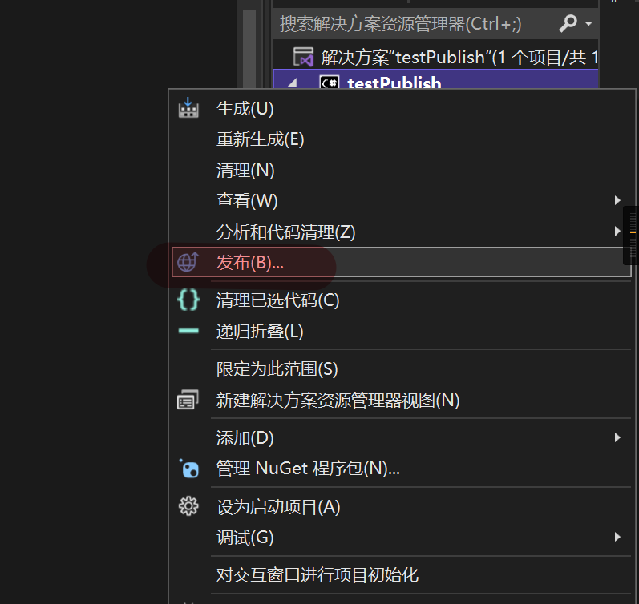
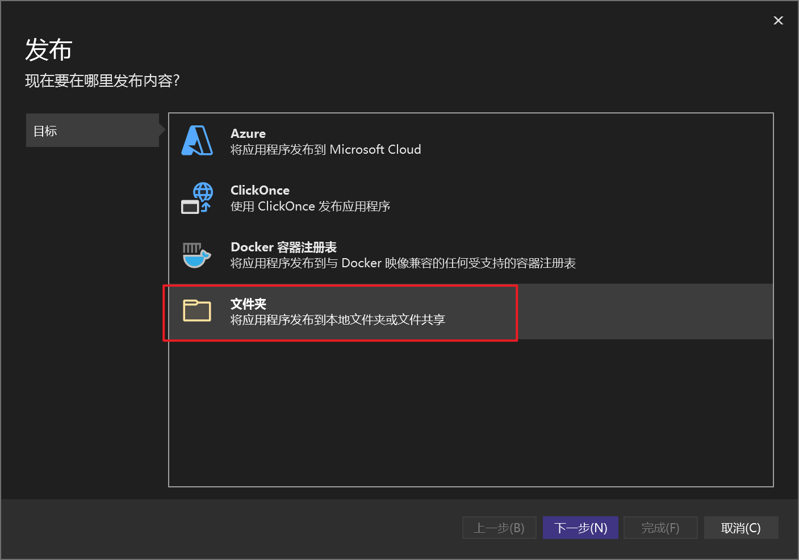
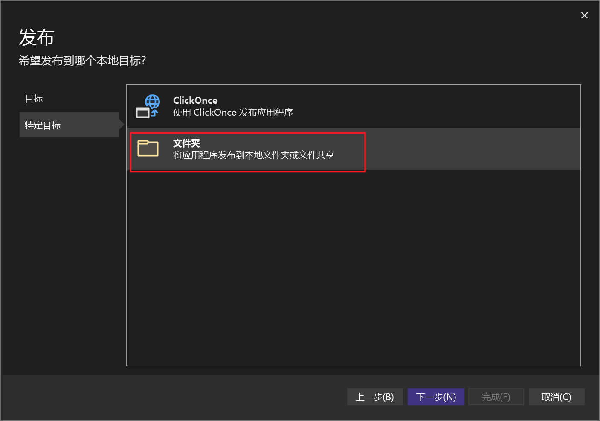
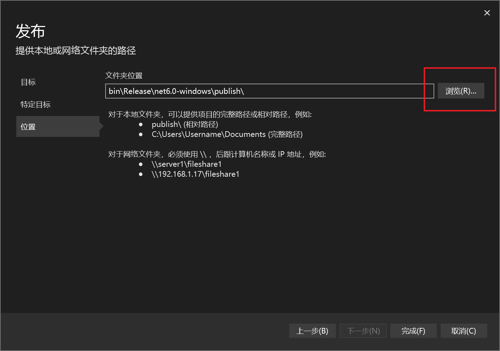
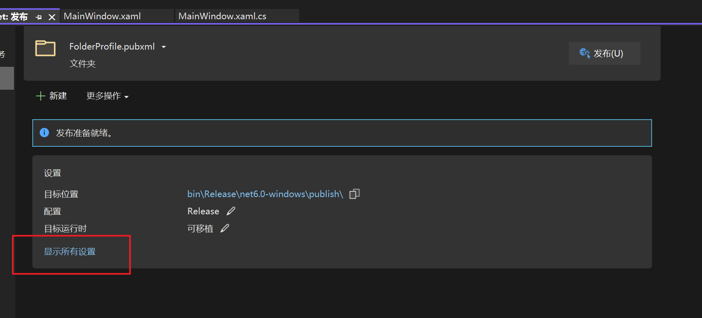
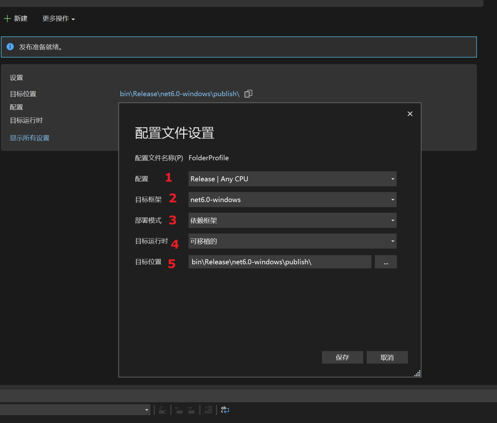
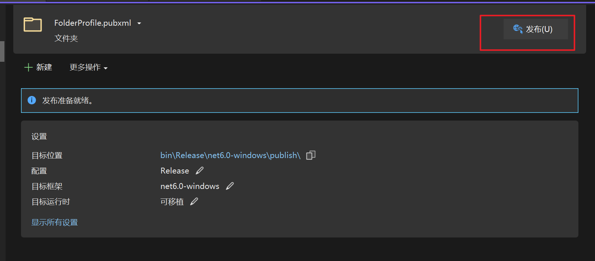

## . Net 发布程序

### 通过vs发布程序

1. 右键选择project

   

2. 选择文件夹（可以选择其他方式上传到云端）

   

   

3. 可以选择生成的路径，然后点击完成

   

4. 可以设置生成

   

   1. 配置： 可以选择生成的配置和平台 release/debug, AnyCPU/x64/x86
      1. 以你实际项目能运行的平台为准
      2. 选错会导致无法正常发布
   2. 目标框架：以你选择的net框架一致
   3. 部署模式：依赖框架/独立
      1. 依赖框架：需要你提前在你电脑上装必要的net运行库
      2. 独立：会生成该程序所有依赖的库在生成路径中
   4. 目标运行时：表示编译后的文件可以部署到windows平台、Max平台、Linux平台。如果只想部署到某一个平台，那么可以选择具体的一个平台 
   5. 目标位置： 发布的位置

5. 设置后 点击发布就可以在指定路径看到生成的程序啦

   

### 通过net publish 发布

- 详情查看[微软官方文档](https://learn.microsoft.com/zh-cn/dotnet/core/tools/dotnet-build?source=recommendations)